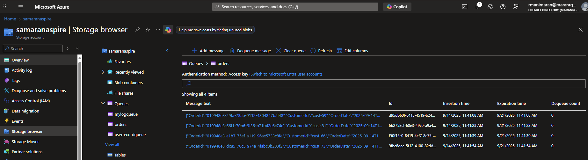
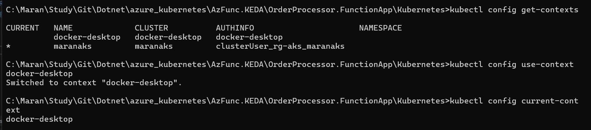
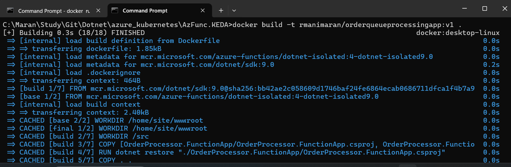
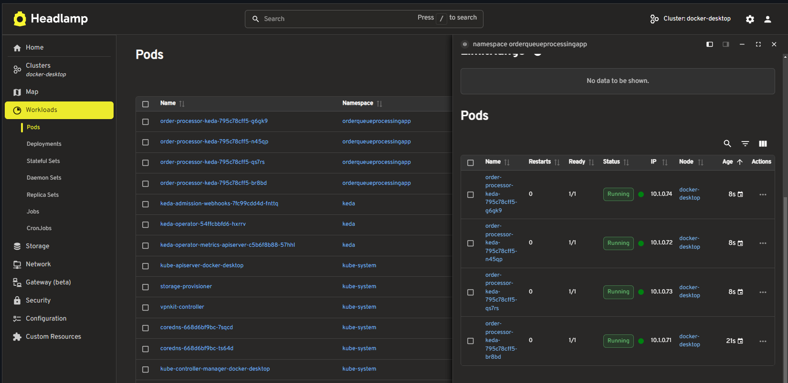
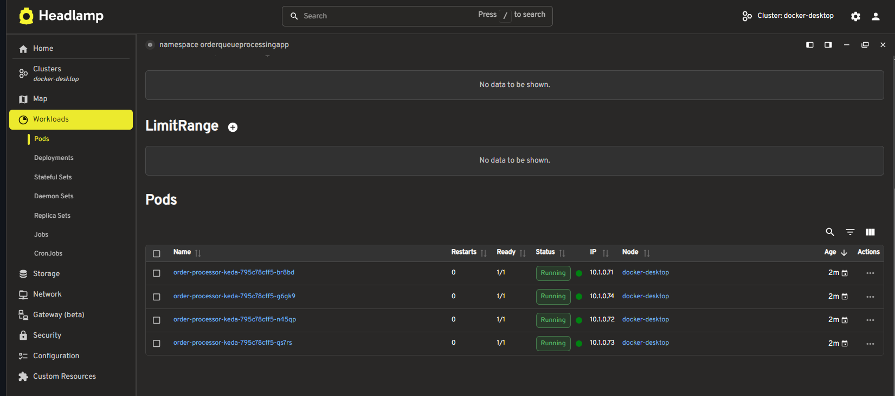
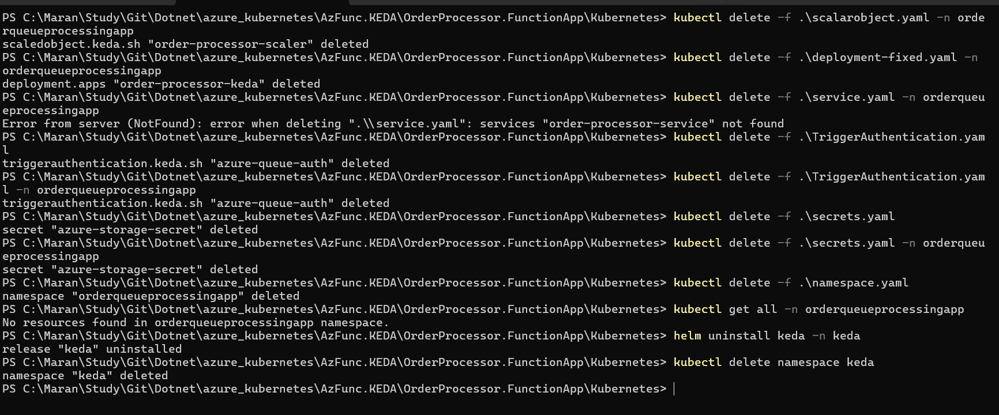

# Azure Functions with KEDA Auto-Scaling on Kubernetes

This project demonstrates how to build and deploy Azure Functions that automatically scale based on Azure Storage Queue messages using KEDA (Kubernetes Event-Driven Autoscaler).

## 📋 What This Project Does

- **Order Processing System**: Creates order events using a background service
- **Queue-Based Processing**: Azure Functions process messages from Azure Storage Queue
- **Auto-Scaling**: KEDA automatically scales pods based on queue length
- **Containerized Deployment**: Runs on Kubernetes with Docker containers



## 🏗️ Project Structure

```
AzFunc.KEDA/
├── OrderProcessor.FunctionApp/     # Azure Function App (Queue Processor)
├── OrderProcessor.WebApi/          # Web API (Order Creator)
├── OrderProcessor.Shared/          # Shared Models
└── Kubernetes/                     # K8s Deployment Files
```

## 🚀 Getting Started

### Prerequisites

1. **Docker Desktop** with Kubernetes enabled
2. **kubectl** command-line tool
3. **Azure Storage Account** (or use Azurite for local development)
4. **Docker Hub Account** (for image hosting)

### Step 1: Setup Kubernetes Context

```bash
# Check available contexts
kubectl config get-contexts

# Set Docker Desktop context
kubectl config use-context docker-desktop

# Verify current context
kubectl config current-context
```



### Step 2: Install KEDA

KEDA enables event-driven autoscaling for Kubernetes workloads.

**Option 1: Using kubectl**
```bash
kubectl apply -f https://github.com/kedacore/keda/releases/download/v2.12.0/keda-2.12.0.yaml
```

**Option 2: Using Helm (Recommended)**
```bash
# Add KEDA Helm repository
helm repo add kedacore https://kedacore.github.io/charts  
helm repo update

# Install KEDA
helm install keda kedacore/keda --namespace keda --create-namespace

# Verify KEDA installation
kubectl get pods -n keda
```

### Step 3: Build and Push Docker Image

```bash
# Navigate to project root
cd AzFunc.KEDA

# Build the Docker image
docker build -t your-dockerhub-username/orderqueueprocessingapp:v1 -f OrderProcessor.FunctionApp/Dockerfile .

# Login to Docker Hub
docker login

# Push image to Docker Hub
docker push your-dockerhub-username/orderqueueprocessingapp:v1
```



### Step 4: Configure Azure Storage

1. Create an Azure Storage Account or use Azurite for local development
2. Create a queue named `orders`
3. Copy the connection string
4. Update `secrets.yaml` with your connection string (base64 encoded)

### Step 5: Deploy to Kubernetes

Deploy the application components in the correct order:

```bash
# 1. Create namespace
kubectl apply -f OrderProcessor.FunctionApp/Kubernetes/namespace.yaml

# 2. Create secrets (contains Azure Storage connection string)
kubectl apply -f OrderProcessor.FunctionApp/Kubernetes/secrets.yaml -n orderqueueprocessingapp

# 3. Create KEDA trigger authentication
kubectl apply -f OrderProcessor.FunctionApp/Kubernetes/TriggerAuthentication.yaml -n orderqueueprocessingapp

# 4. Deploy the Azure Function application
kubectl apply -f OrderProcessor.FunctionApp/Kubernetes/deployment-fixed.yaml -n orderqueueprocessingapp

# 5. Create service to expose the application
kubectl apply -f OrderProcessor.FunctionApp/Kubernetes/service.yaml -n orderqueueprocessingapp

# 6. Create KEDA ScaledObject (must be last)
kubectl apply -f OrderProcessor.FunctionApp/Kubernetes/scalarobject.yaml -n orderqueueprocessingapp
```

## 🔍 Verification and Monitoring

### Check Deployment Status

```bash
# Check all resources in the namespace
kubectl get all -n orderqueueprocessingapp

# Check specific resources
kubectl get pods,svc,secrets,scaledobjects -n orderqueueprocessingapp

# Check KEDA scaling status
kubectl get hpa -n orderqueueprocessingapp
kubectl describe scaledobject order-processor-scaler -n orderqueueprocessingapp
```

### Monitor Logs

```bash
# View logs from all pods
kubectl logs -l app=order-processor-keda -n orderqueueprocessingapp --tail=50

# Follow logs in real-time
kubectl logs -f -l app=order-processor-keda -n orderqueueprocessingapp --timestamps

# View logs from specific pod
kubectl logs <pod-name> -n orderqueueprocessingapp
```

## 🧪 Testing Auto-Scaling

### How KEDA Scaling Works

1. **Queue Monitoring**: KEDA monitors the Azure Storage Queue `orders`
2. **Scaling Trigger**: When queue length > 2 messages, KEDA creates additional pods
3. **Scale Down**: When queue is empty, KEDA scales down to 0 pods (saves resources)
4. **Scale Up**: New messages automatically wake up pods

### Test Scaling Behavior

1. **Start the Order Creator**: Run the WebAPI to generate order events
2. **Monitor Queue**: Watch messages accumulate in the Azure Storage Queue
3. **Observe Scaling**: Use `kubectl get pods -w` to watch pods scale up/down
4. **Check Logs**: Monitor processing with `kubectl logs -f`

```bash
# Watch pods scale in real-time
kubectl get pods -n orderqueueprocessingapp -w

# Monitor HPA scaling decisions
kubectl get hpa -n orderqueueprocessingapp -w
```





## 🔧 Troubleshooting

### Common Issues

1. **Image Pull Errors**: Ensure Docker image exists and is public on Docker Hub
2. **Secret Not Found**: Verify secrets are created in the correct namespace
3. **KEDA Not Scaling**: Check TriggerAuthentication and connection string
4. **Pod Startup Issues**: Check logs for connection or configuration errors

### Debug Commands

```bash
# Check pod status and events
kubectl describe pod <pod-name> -n orderqueueprocessingapp

# Check KEDA operator logs
kubectl logs -n keda deployment/keda-operator

# Check events in namespace
kubectl get events -n orderqueueprocessingapp --sort-by='.lastTimestamp'
```

## 🎯 Key Features Demonstrated

- ✅ **Event-Driven Scaling**: Pods scale based on queue length
- ✅ **Zero-to-N Scaling**: Scales from 0 pods to multiple pods automatically
- ✅ **Resource Efficiency**: No idle pods when no work to process
- ✅ **Azure Integration**: Works with Azure Storage Queues
- ✅ **Production Ready**: Includes health checks, resource limits, and security context

## 🧹 Cleanup Process

### Safe Application Cleanup

When you're done testing or want to remove the application, follow this order to safely clean up all resources:

```bash
# 1. Delete ScaledObject first (stops KEDA scaling)
kubectl delete scaledobject order-processor-scaler -n orderqueueprocessingapp

# 2. Delete the deployment (removes pods)
kubectl delete deployment order-processor-keda -n orderqueueprocessingapp

# 3. Delete the service
kubectl delete service order-processor-service -n orderqueueprocessingapp

# 4. Delete TriggerAuthentication
kubectl delete triggerauthentication azure-queue-auth -n orderqueueprocessingapp

# 5. Delete secrets
kubectl delete secret azure-storage-secret -n orderqueueprocessingapp

# 6. Delete the namespace (removes everything in the namespace)
kubectl delete namespace orderqueueprocessingapp
```

### Alternative: Delete All Resources at Once

```bash
# Delete entire namespace and all its resources
kubectl delete namespace orderqueueprocessingapp

# Verify cleanup
kubectl get all -n orderqueueprocessingapp
```

### Uninstall KEDA (Optional)

If you want to completely remove KEDA from your cluster:

**If installed via Helm:**
```bash
# Uninstall KEDA
helm uninstall keda -n keda

# Delete KEDA namespace
kubectl delete namespace keda
```

**If installed via kubectl:**
```bash
# Remove KEDA installation
kubectl delete -f https://github.com/kedacore/keda/releases/download/v2.12.0/keda-2.12.0.yaml
```

### Clean Up Docker Images (Optional)

```bash
# Remove local Docker images
docker rmi your-dockerhub-username/orderqueueprocessingapp:v1

# Clean up unused Docker resources
docker system prune -f
```

### Verification Commands

```bash
# Verify all resources are deleted
kubectl get all -A | grep orderqueueprocessingapp

# Check if KEDA is removed
kubectl get pods -n keda

# Verify no hanging HPA resources
kubectl get hpa -A
```

**⚠️ Important Notes:**
- Always delete ScaledObject before the deployment to prevent orphaned HPA resources
- Wait for pods to terminate gracefully before deleting the namespace
- Deleting the namespace removes all resources within it, including secrets and configurations

## 📚 Learn More

- [KEDA Documentation](https://keda.sh/)
- [Azure Functions on Kubernetes](https://docs.microsoft.com/en-us/azure/azure-functions/functions-kubernetes-keda)
- [Kubernetes Horizontal Pod Autoscaler](https://kubernetes.io/docs/tasks/run-application/horizontal-pod-autoscale/)

---

**Note**: All pods automatically terminate after processing all messages in the queue, demonstrating efficient resource utilization.