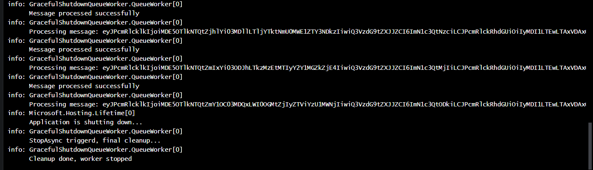
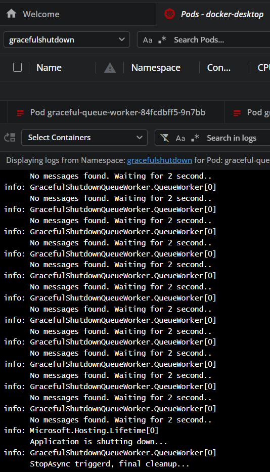

## Create Docker Image with Tag

## Push Image to Docker Hub

## Test the SIGTERM in Docker

## Kubernetes deployment
1. Create Namespace

2. Create Secret

3. Apply deployment

4. Validate the Queue Processing and test the graceful shutdown

5. Terminate and do the cleanup

