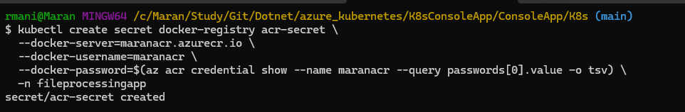
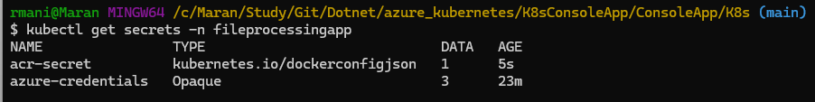

# Running Console App in Local Kubernetes with Azure Container Registry

This guide walks you through deploying a .NET Console Application to a local Kubernetes cluster (Docker Desktop) that connects to Azure Key Vault. The application image will be pulled from Azure Container Registry (ACR).

## What You'll Need

- **Docker Desktop** with Kubernetes enabled
- **kubectl** installed and configured
- **Azure CLI** installed and authenticated
- **Azure Container Registry** with your application image
- **Azure Key Vault** (example: `kv-maransys`)
- **Service Principal** with Key Vault access

## Prerequisites Setup

### 1. Enable Kubernetes in Docker Desktop
- Open Docker Desktop → Settings → Kubernetes
- Check "Enable Kubernetes" and apply

### 2. Verify Kubernetes Connection
```bash
kubectl cluster-info
kubectl get nodes
```

### 3. Login to Azure
```bash
az login
```

## Step-by-Step Deployment

### Step 1: Create Service Principal (if not exists)

Create a service principal for Azure Key Vault access:

```bash
az ad sp create-for-rbac --name "FileProcessingApp" --role contributor --scopes /subscriptions/$(az account show --query id --output tsv)
```

This returns credentials like:
```json
{
  "appId": "ea37d837-46bf-471c-8731-4a9131c0342d",
  "displayName": "FileProcessingApp",
  "password": "your-generated-secret",
  "tenant": "29134a7e-7a24-4157-a211-6bf8b10f1ce0"
}
```

**Save these values** - you'll need them for Kubernetes secrets.

### Step 2: Grant Key Vault Access

Grant the service principal access to your Key Vault:

```bash
az role assignment create \
  --role "Key Vault Secrets User" \
  --assignee "ea37d837-46bf-471c-8731-4a9131c0342d" \
  --scope "/subscriptions/$(az account show --query id --output tsv)/resourceGroups/your-rg-name/providers/Microsoft.KeyVault/vaults/kv-maransys"
```

### Step 3: Deploy Kubernetes Resources

Deploy the resources in the following order:

#### 3.1 Create Namespace
```bash
kubectl apply -f namespace.yaml
```

#### 3.2 Create ConfigMap (Non-sensitive configuration)
```bash
kubectl apply -f configmap.yaml
```

#### 3.3 Create Secrets (Azure credentials)
```bash
kubectl apply -f secrets.yaml
```

#### 3.4 Create ACR Image Pull Secret
This allows Kubernetes to pull images from your Azure Container Registry:

```bash
kubectl create secret docker-registry acr-secret \
  --docker-server=maranacr.azurecr.io \
  --docker-username=ea37d837-46bf-471c-8731-4a9131c0342d \
  --docker-password=passwordhere \
  -n fileprocessingapp
```

> **Note:** Use your actual service principal credentials from Step 1

#### 3.5 Deploy the Application
```bash
kubectl apply -f deployment.yaml
```

### Step 4: Verify Deployment

#### Check all resources:
```bash
kubectl get all,configmaps,secrets -n fileprocessingapp
```

#### Check pod status:
```bash
kubectl get pods -n fileprocessingapp
kubectl describe pod <pod-name> -n fileprocessingapp
```

#### View application logs:
```bash
kubectl logs -l app=fileprocessingapp -n fileprocessingapp
```

#### Check ConfigMap contents:
```bash
kubectl describe configmap fileprocessingapp-config -n fileprocessingapp
```

## File Structure

Your K8s directory should contain:
```
K8s/
├── namespace.yaml      # Creates fileprocessingapp namespace
├── configmap.yaml      # Contains KeyVaultUrl
├── secrets.yaml        # Contains Azure credentials
└── deployment.yaml     # Application deployment with ACR image
```

## Troubleshooting

### Image Pull Errors
- **Issue**: `ErrImagePull` or `ImagePullBackOff`
- **Solution**: Verify ACR secret exists and has correct credentials

### Authentication Errors
- **Issue**: Key Vault access denied
- **Solution**: Check service principal has correct Key Vault permissions

### Pod Startup Issues
- **Issue**: Pod crashes or fails to start
- **Solution**: Check logs with `kubectl logs <pod-name> -n fileprocessingapp`

### Resource Not Found
- **Issue**: ConfigMap or Secret not found
- **Solution**: Ensure resources are created in correct namespace

## Clean Up

To remove all resources:
```bash
kubectl delete namespace fileprocessingapp
```

This removes the namespace and all resources within it.



