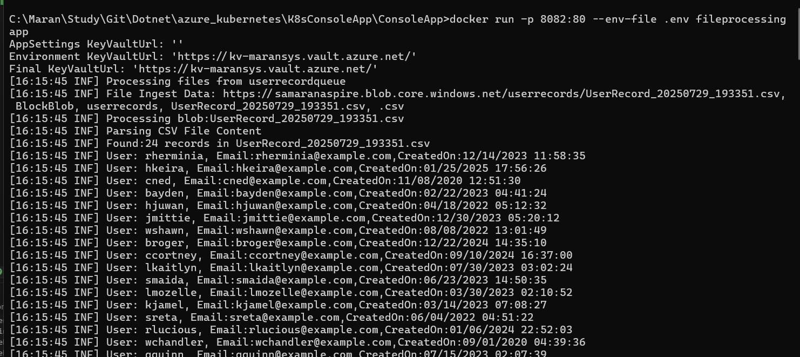

# Console App with Azure Key Vault - Docker Deployment Guide

This guide walks you through running a .NET console application that connects to Azure Key Vault in a Docker container.

## What You'll Need

- Azure CLI installed on your machine
- Docker installed and running
- An Azure subscription with access to create resources
- An existing Azure Key Vault (in this example: `kv-maransys`)

## Step-by-Step Setup

### Step 1: Login to Azure

First, authenticate with your Azure account:

```bash
az login
```

This opens your browser to sign in to Azure.

### Step 2: Create a Service Principal

A service principal is like a "service account" that allows your application to authenticate with Azure services.

**Option A: Subscription-level access (broader permissions)**
```bash
az ad sp create-for-rbac --name "FileProcessingApp" --role contributor --scopes /subscriptions/$(az account show --query id --output tsv)
```

**Option B: Resource group-level access (more secure)**
```bash
az ad sp create-for-rbac --name "FileProcessingApp" --role contributor --scopes /subscriptions/$(az account show --query id --output tsv)/resourceGroups/your-resource-group-name
```

> **Note:** Replace `your-resource-group-name` with your actual resource group name.

Both commands will return credentials like this:
```json
{
  "appId": "12345678-1234-1234-1234-123456789abc",
  "displayName": "FileProcessingApp",
  "password": "your-generated-secret",
  "tenant": "87654321-4321-4321-4321-cba987654321"
}
```

**Save these values** - you'll need them in the next steps!

### Step 3: Grant Key Vault Access

Your service principal needs permission to read secrets from Key Vault. The method depends on your Key Vault's access model:

**For Access Policy-based Key Vaults:**
```bash
az keyvault set-policy --name kv-maransys --spn "your-app-id" --secret-permissions get list
```

**For RBAC-enabled Key Vaults:**
```bash
az role assignment create \
  --role "Key Vault Secrets User" \
  --assignee "your-app-id" \
  --scope "/subscriptions/$(az account show --query id --output tsv)/resourceGroups/your-rg-name/providers/Microsoft.KeyVault/vaults/kv-maransys"
```

> **How to check which type?** In Azure Portal, go to your Key Vault → Access policies. If you see "Access policies not available", it's RBAC-enabled.

### Step 4: Create Environment File

Create a `.env` file in your project directory with the service principal credentials:

```bash
KeyVaultUrl=https://kv-maransys.vault.azure.net/
AZURE_CLIENT_ID=your-app-id-from-step-2
AZURE_CLIENT_SECRET=your-password-from-step-2
AZURE_TENANT_ID=your-tenant-from-step-2
```

> **Security tip:** Never commit the `.env` file to source control. Add it to your `.gitignore`.

### Step 5: Build Docker Image

Build your Docker image with a tag:

```bash
docker build -t fileprocessingapp .
```

### Step 6: Run the Container

Run your application in Docker, passing the environment variables:

```bash
docker run -p 8082:80 --env-file .env fileprocessingapp
```

Your application will now be running on `http://localhost:8082` and can securely access Azure Key Vault.



## Alternative: Using Azure Portal

If you prefer using the Azure Portal instead of CLI:

### Create Service Principal via Portal:
1. Go to **Azure Active Directory** → **App registrations**
2. Click **"New registration"**
3. Name it "FileProcessingApp" and register
4. Go to **Certificates & secrets** → Create a new client secret
5. Copy the Application ID, Tenant ID, and secret value

### Grant Key Vault Access via Portal:
1. Navigate to your Key Vault **"kv-maransys"**
2. Go to **Access control (IAM)**
3. Click **"Add role assignment"**
4. Select **"Key Vault Secrets User"** role
5. Search for and select **"FileProcessingApp"**
6. Click **"Review + assign"**

## Troubleshooting

- **"Access policies not available"**: Your Key Vault uses RBAC - use the role assignment method
- **Authentication failed**: Double-check your `.env` file values match the service principal output
- **Permission denied**: Ensure the service principal has the correct Key Vault permissions

